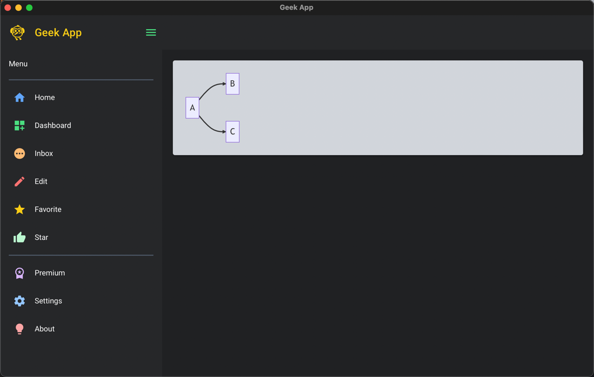

# nicegui:

## Examples:

### APP UI Template:

- ✅️ check [Taskfile.yml](Taskfile.yml), run scripts

```ruby
# git repo root dir:
task try:nicegui:run

```

> preview:

- 对应示例5: [run05_tpl.py](./src/try_nicegui/run05_tpl.py)



### Tray Menu:

- ✅️ check [Taskfile.yml](Taskfile.yml), run scripts

> run app:

```ruby

# git repo root dir:
task try:nicegui:run:tray


# this dir:
task run:tray


```

## fix poetry + pyenv:

```ruby
#
pyenv local py310-exe

# 核心！！
poetry env use $(pyenv which python3)

```

- 检查 [poetry.toml](poetry.toml) 参数：
- 🛑 更改 python 版本， 每次都要重装 poetry， 否则 poetry 始终指向错的版本。

```toml
[virtualenvs]
prefer-active-python = true  # 核心
in-project = false # release app  # todo x: 依赖！
create = false   # release app # todo x: 依赖！ [ poetry env use $(pyenv which python3) ]


```

## References:

> png to ico:

- https://cloudconvert.com/png-to-ico

> release app:

- https://pyinstaller.org/en/stable/
- [《PyInstaller打包实战指南》第四节 给应用程序加上图标](https://zhuanlan.zhihu.com/p/86956034)

> tray menu:

- ✅️ https://github.com/zauberzeug/nicegui/discussions/980
    - tray menu